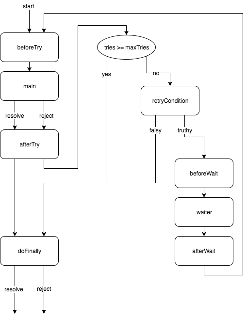

# retryx

[](https://www.npmjs.com/package/retryx)
[](https://travis-ci.org/y13i/retryx)
[](https://coveralls.io/github/y13i/retryx?branch=master)

## About

`retryx` (__ritrɪ́ks__) is a Promise-based retry workflow library.

## Installation

```
$ npm install --save retryx
```

## Usage

### Flowchart



### API

#### `retryx`

```javascript
retryx(main [, options [, ...args]])
```

`main` is a function returns Promise that might be rejected. **Required**

`options` is a object contains `maxTries`, `waiter` and other hooks. **Optional**

`...args` will be passed to main function call. **Optional**

#### `options`

```javascript
{
  maxTries:       number,
  timeout:        number,
  waiter:         HookFunction,
  retryCondition: HookFunction,
  beforeTry:      HookFunction,
  afterTry:       HookFunction,
  beforeWait:     HookFunction,
  afterWait:      HookFunction,
  doFinally:      HookFunction,
}
```

`HookFunction` can receive current try count and last reject reason as arguments. See [source](lib/executor.ts#L4).

##### `maxTries`

Attempts calling main function specified times or until succeeds.

Set `-1` to retry unlimitedly.

default: `5`

##### `timeout`

Sets the timeout.

Set `-1` to no timeout.

default: `-1`

##### `waiter`

Hook function called before each retry. It's meant to return a Promise that resolves after specific duration.

default: exponential backoff. 100ms, 400ms, 900ms, 1600ms and so on.

See [default waiter implementation](lib/executor.ts#L24). You can create custom waiter with [wait function](lib/wait.ts) for shorthand.

##### `retryCondition`

Hook function called AFTER each try. If it returns falsy value, retrying will be abandoned even not reaching `maxTries`.

default: always return true

##### `beforeTry`

Hook function called BEFORE each try.

default: nothing to do

##### `afterTry`

Hook function called AFTER each try.

default: nothing to do

##### `beforeWait`

Hook function called BEFORE each wait.

default: nothing to do

##### `afterWait`

Hook function called AFTER each wait.

default: nothing to do

##### `doFinally`

Hook function called ONCE whether main function resolved or rejected.

default: nothing to do

### Creating an instance

You can create a new instance of retryx with a custom config.

`retryx.create(options)`

```javascript
const myRetryx = retryx.create({
  maxTries: 100,
  waiter:   () => new Promise(r => setTimeout(r, 10)),
});
```

### Examples

#### With [AWS SDK](https://github.com/aws/aws-sdk-js)

```javascript
const retryx = require("retryx");
const AWS = require("aws-sdk");

const ec2 = new AWS.EC2();

retryx(() => ec2.describeRegions().promise()).then(response => {
  console.log(response);
});
```

#### With [axios](https://github.com/mzabriskie/axios)

```javascript
const retryx = require("retryx");
const axios = require("axios");

retryx(() => axios.get("http://example.com")).then(response => {
  console.log(response.statusText);
});
```

#### With async/await

```javascript
import retryx from "retryx";

(async () => {
  try {
    const result = await retryx(() => {
      const number = Math.round(Math.random() * 100);

      if (number > 95) {
        return number;
      } else {
        throw number;
      }
    });

    console.log("success", result);
  } catch (n) {
    console.log("fail:", n)
  }
})();
```

#### With hooks

```javascript
const retryx = require("retryx");

retryx(() => {
  const number = Math.round(Math.random() * 100);
  return number > 95 ? Promise.resolve(number) : Promise.reject(number);
}, {
  maxTries:   100,
  beforeWait: (tries) => console.log(`try #${tries} failed. wait 100 ms`),
  waiter:     () => new Promise((r) => setTimeout(r, 100)),
}).then(result => {
  console.log(`success: ${result}`);
});
```

#### TypeScript type inference

```typescript
import retryx from "retryx";

(async () => {
  let result = await retryx(() => 123);
  result = "abc"; // ERROR: Type '"abc"' is not assignable to type 'number'.
})();
```

#### TypeScript generics

```typescript
import retryx from "retryx";

(async () => {
  let result = await retryx<string>(() => { // Explicitly specifies type of promised value to return.
    const number = Math.round(Math.random() * 100);

    if (number < 50) {
      throw new Error();
    } else if (number < 80) {
      return "good";
    } else if (number < 90) {
      return "great";
    } else {
      return number; // ERROR: Type 'number' is not assignable to type 'string | Promise<string>'.
    }
  });
})();
```

### See also

- [Test codes](test/)

## Development

```
$ git clone
$ cd retryx
$ yarn
```

Test.

```
$ yarn test
```
